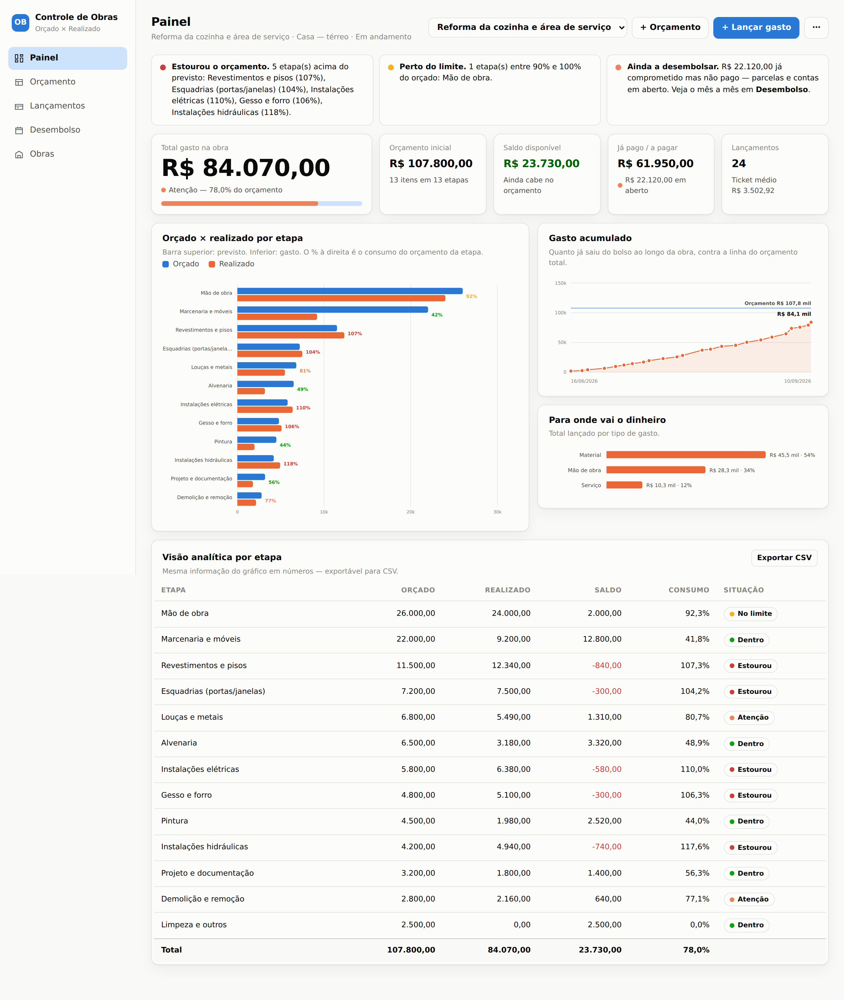
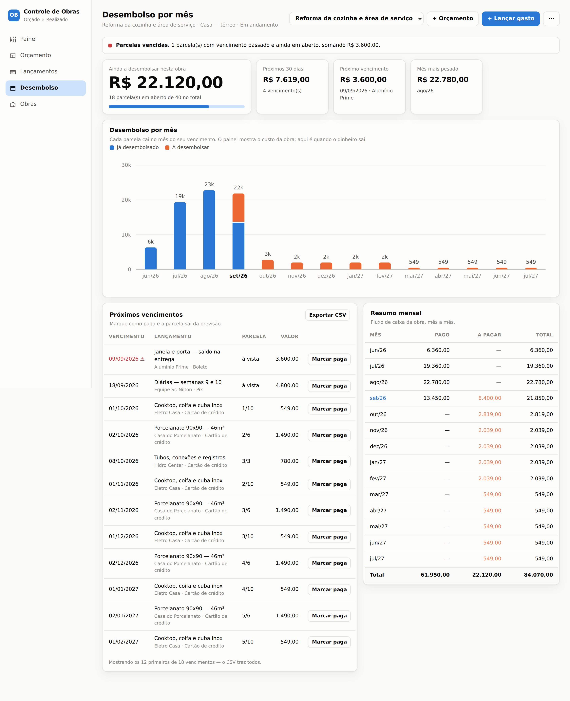
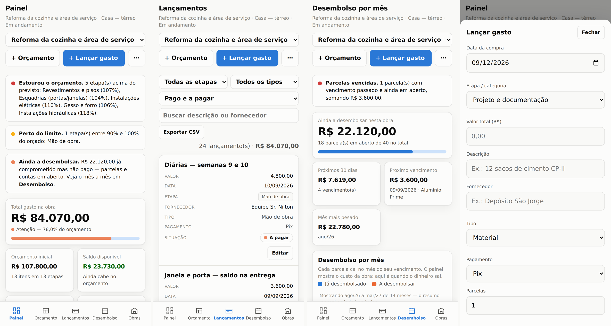

# Controle de Obras

Controle de despesas de obra em casa: orçamento por etapa, lançamento de
gastos, parcelamento no cartão, fotos de nota fiscal e previsão de
desembolso mês a mês.

Aplicativo de arquivo único — HTML, CSS e JavaScript em `index.html`, sem
build, sem dependências e sem servidor. **Os dados ficam no navegador de
quem abre**, não em nenhum servidor: abrir este site não dá acesso a dado
nenhum de ninguém.

## O que ele responde

| Pergunta | Onde |
|---|---|
| Quanto já gastei no total? | Número grande do painel + barra de consumo do orçamento |
| Estou dentro do orçamento? | Saldo disponível e o % de consumo (verde / amarelo / vermelho) |
| Qual etapa estourou? | Alertas no topo + coluna "Situação" da tabela analítica |
| Onde o dinheiro está indo? | Gráfico "Para onde vai o dinheiro" (material, mão de obra, serviço…) |
| Como o gasto evoluiu? | "Gasto acumulado" contra a linha do orçamento total |
| Quanto sai do bolso em cada mês? | Aba **Desembolso** |
| O que ainda não paguei? | KPI "Já pago / a pagar" + aba Desembolso |

## Começando

1. Abra o site e clique em **+ Lançar gasto** → **Nova obra**.
2. Na aba **Orçamento**, lance quanto previu gastar em cada etapa.
3. Na aba **Lançamentos**, registre cada gasto conforme ele acontece.

Para ver o app com dados antes de cadastrar qualquer coisa, acrescente
`?demo=1` ao endereço — carrega uma obra de exemplo.

## Parcelamento no cartão

Informe **Parcelas** e o **1º vencimento**. Duas coisas acontecem, e a
diferença entre elas é o ponto:

- **O custo da obra** conta o **valor cheio na data da compra**. R$ 5.490
  em 10x no dia 01/09 consomem R$ 5.490 da etapa em 01/09 — o compromisso
  já assumido, não o extrato do cartão.
- **O caixa** é acompanhado parcela por parcela na aba **Desembolso**.

Por isso "Total gasto" e "Já pago" são números diferentes, e devem ser.

O rateio joga a sobra de centavos na última parcela (R$ 1.000 em 3x vira
333,33 + 333,33 + 333,34). Datas respeitam o fim do mês: vencimento 31/01
parcela em 28/02, não em 03/03.

## Fotos

Cada lançamento aceita fotos — nota fiscal, serviço pronto, o estrago que
justificou o gasto extra. São reduzidas para 1600px e convertidas em JPEG
antes de salvar (uma foto de celular de 4 MB fica em torno de 200 KB),
guardadas em IndexedDB e incluídas no backup `.json`.

## No celular

Navegação na base, tabelas em cartões, formulário como folha pelo rodapé e
gráficos redesenhados em escala maior. Dá para adicionar à tela de início
pelo Safari e usar como app.

**Os dados são por aparelho.** O navegador do iPhone e o do Mac têm bancos
separados — não existe sincronização automática. Para passar dados de um
para o outro, use **Exportar backup** / **Importar backup** no menu **⋯**.
A importação substitui tudo e avisa antes: quem importa por último apaga o
que o outro lançou.

## Backup e exportações

- **Exportar backup** → `.json` completo, com fotos (restaurável pelo Importar).
- **CSV do painel** → visão analítica por etapa.
- **CSV dos lançamentos** → respeita os filtros aplicados na tela.
- **CSV do desembolso** → uma linha por parcela, para cruzar com a fatura do cartão.

Os CSVs saem com `;` e BOM, então abrem direto no Excel em português sem
bagunçar acentos nem colunas.

## Publicando sua própria cópia

Faça um fork, ative o GitHub Pages em **Settings → Pages → Branch: main /
(root)** e pronto. Não há nada para configurar no código.
